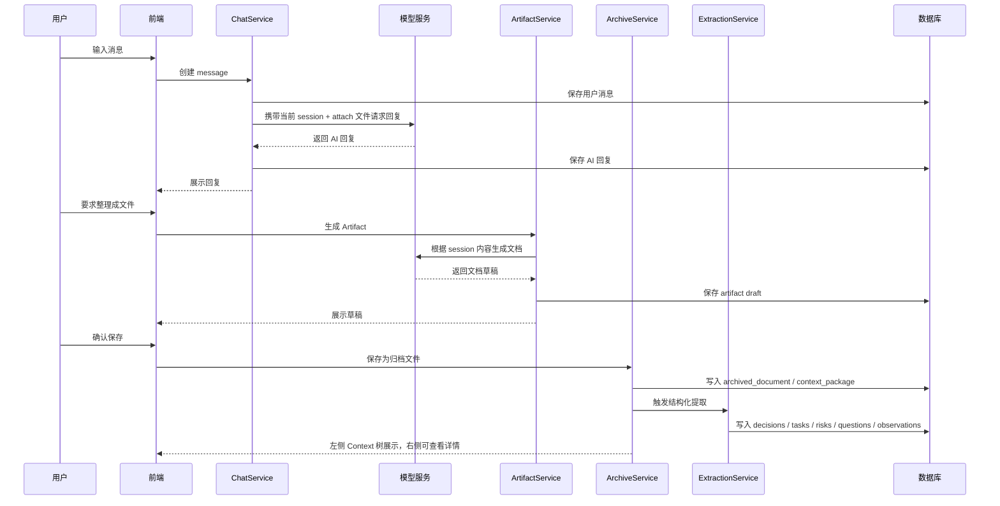

# 后端最小闭环图

```mermaid
sequenceDiagram
  participant User as 用户
  participant UI as 前端
  participant Chat as ChatService
  participant LLM as 模型服务
  participant Artifact as ArtifactService
  participant Archive as ArchiveService
  participant Extract as ExtractionService
  participant DB as 数据库

  User->>UI: 输入消息
  UI->>Chat: 创建 message
  Chat->>DB: 保存用户消息
  Chat->>LLM: 携带当前 session + attach 文件请求回复
  LLM-->>Chat: 返回 AI 回复
  Chat->>DB: 保存 AI 回复
  Chat-->>UI: 展示回复

  User->>UI: 要求整理成文件
  UI->>Artifact: 生成 Artifact
  Artifact->>LLM: 根据 session 内容生成文档
  LLM-->>Artifact: 返回文档草稿
  Artifact->>DB: 保存 artifact draft
  Artifact-->>UI: 展示草稿

  User->>UI: 确认保存
  UI->>Archive: 保存为归档文件
  Archive->>DB: 写入 archived_document / context_package
  Archive->>Extract: 触发结构化提取
  Extract->>DB: 写入 decisions / tasks / risks / questions / observations
  Archive-->>UI: 左侧 Context 树展示，右侧可查看详情
```
