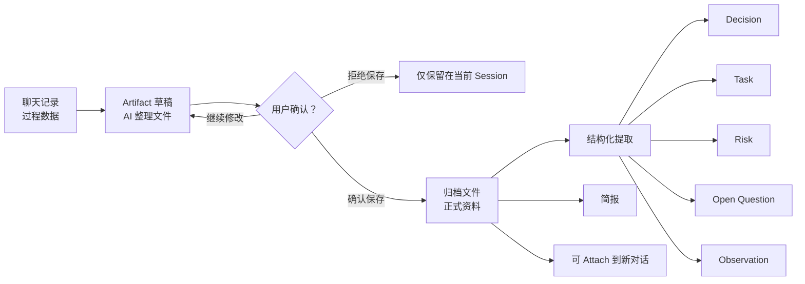

# 内容状态流转图

```mermaid
flowchart LR
  Chat["聊天记录<br/>过程数据"] --> Artifact["Artifact 草稿<br/>AI 整理文件"]
  Artifact --> Review{"用户确认？"}
  Review -- "继续修改" --> Artifact
  Review -- "拒绝保存" --> DraftOnly["仅保留在当前 Session"]
  Review -- "确认保存" --> Archive["归档文件<br/>正式资料"]

  Archive --> Extraction["结构化提取"]
  Extraction --> Decision["Decision"]
  Extraction --> Task["Task"]
  Extraction --> Risk["Risk"]
  Extraction --> Question["Open Question"]
  Extraction --> Observation["Observation"]

  Archive --> Briefing["简报"]
  Archive --> Attach["可 Attach 到新对话"]
```
