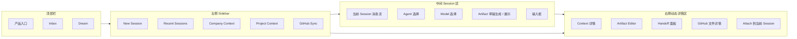

# 前端页面职责图

```mermaid
flowchart LR
  subgraph Top["顶部栏"]
    T1["产品入口"]
    T2["Inbox"]
    T3["Dream"]
  end

  subgraph Left["左侧 Sidebar"]
    L1["New Session"]
    L2["Recent Sessions"]
    L3["Company Context"]
    L4["Project Context"]
    L5["GitHub Sync"]
  end

  subgraph Center["中间 Session 区"]
    C1["当前 Session 消息流"]
    C2["Agent 选择"]
    C3["Model 选择"]
    C4["Artifact 草稿生成 / 展示"]
    C5["输入框"]
  end

  subgraph Right["右侧动态详情区"]
    R1["Context 详情"]
    R2["Artifact Editor"]
    R3["Handoff 面板"]
    R4["GitHub 文件详情"]
    R5["Attach 到当前 Session"]
  end

  Top --> Left
  Left --> Center
  Center --> Right
  Left --> Right
```
