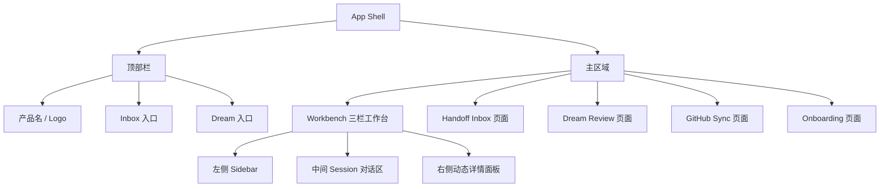

# 前端页面结构图

```mermaid
flowchart TD
  App["App Shell"]

  App --> Topbar["顶部栏"]
  App --> Main["主区域"]

  Topbar --> Brand["产品名 / Logo"]
  Topbar --> InboxBtn["Inbox 入口"]
  Topbar --> DreamBtn["Dream 入口"]

  Main --> Workbench["Workbench 三栏工作台"]
  Main --> InboxPage["Handoff Inbox 页面"]
  Main --> DreamPage["Dream Review 页面"]
  Main --> GithubPage["GitHub Sync 页面"]
  Main --> OnboardingPage["Onboarding 页面"]

  Workbench --> Left["左侧 Sidebar"]
  Workbench --> Center["中间 Session 对话区"]
  Workbench --> Right["右侧动态详情面板"]
```
