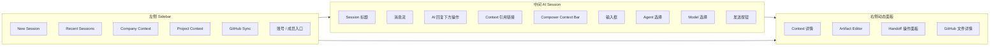

# 前端三栏 Workbench 图

```mermaid
flowchart LR
  subgraph Left["左侧 Sidebar"]
    L1["New Session"]
    L2["Recent Sessions"]
    L3["Company Context"]
    L4["Project Context"]
    L5["GitHub Sync"]
    L6["账号 / 成员入口"]
  end

  subgraph Center["中间 AI Session"]
    C1["Session 标题"]
    C2["消息流"]
    C3["AI 回复下方操作"]
    C4["Context 引用链接"]
    C5["Composer Context Bar"]
    C6["输入框"]
    C7["Agent 选择"]
    C8["Model 选择"]
    C9["发送按钮"]
  end

  subgraph Right["右侧动态面板"]
    R1["Context 详情"]
    R2["Artifact Editor"]
    R3["Handoff 操作面板"]
    R4["GitHub 文件详情"]
  end

  Left --> Center
  Center --> Right
  Left --> Right
```
