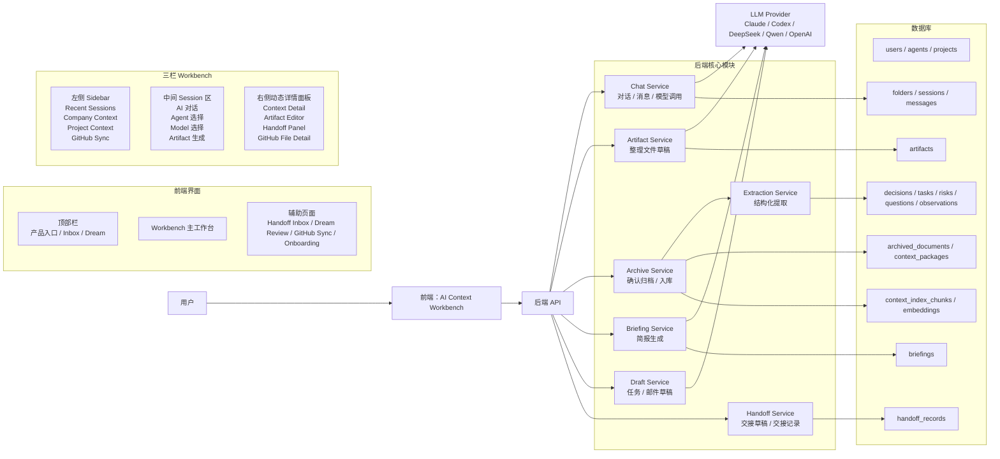

# 整体架构图

```mermaid
flowchart LR
  U["用户"] --> FE["前端：AI Context Workbench"]

  subgraph FEUI["前端界面"]
    Top["顶部栏<br/>产品入口 / Inbox / Dream"]
    W["Workbench 主工作台"]
    Pages["辅助页面<br/>Handoff Inbox / Dream Review / GitHub Sync / Onboarding"]
  end

  subgraph Workbench["三栏 Workbench"]
    L["左侧 Sidebar<br/>Recent Sessions<br/>Company Context<br/>Project Context<br/>GitHub Sync"]
    C["中间 Session 区<br/>AI 对话<br/>Agent 选择<br/>Model 选择<br/>Artifact 生成"]
    R["右侧动态详情面板<br/>Context Detail<br/>Artifact Editor<br/>Handoff Panel<br/>GitHub File Detail"]
  end

  FE --> API["后端 API"]

  subgraph BE["后端核心模块"]
    Chat["Chat Service<br/>对话 / 消息 / 模型调用"]
    Artifact["Artifact Service<br/>整理文件草稿"]
    Archive["Archive Service<br/>确认归档 / 入库"]
    Extraction["Extraction Service<br/>结构化提取"]
    Briefing["Briefing Service<br/>简报生成"]
    Draft["Draft Service<br/>任务 / 邮件草稿"]
    Handoff["Handoff Service<br/>交接草稿 / 交接记录"]
  end

  API --> Chat
  API --> Artifact
  API --> Archive
  API --> Briefing
  API --> Draft
  API --> Handoff

  Chat --> LLM["LLM Provider<br/>Claude / Codex / DeepSeek / Qwen / OpenAI"]
  Artifact --> LLM
  Briefing --> LLM
  Draft --> LLM

  Archive --> Extraction

  subgraph DB["数据库"]
    Users["users / agents / projects"]
    Sessions["folders / sessions / messages"]
    Artifacts["artifacts"]
    Docs["archived_documents / context_packages"]
    Structured["decisions / tasks / risks / questions / observations"]
    Briefings["briefings"]
    Handoffs["handoff_records"]
    Retrieval["context_index_chunks / embeddings"]
  end

  Chat --> Sessions
  Artifact --> Artifacts
  Archive --> Docs
  Extraction --> Structured
  Briefing --> Briefings
  Handoff --> Handoffs
  Archive --> Retrieval
```
