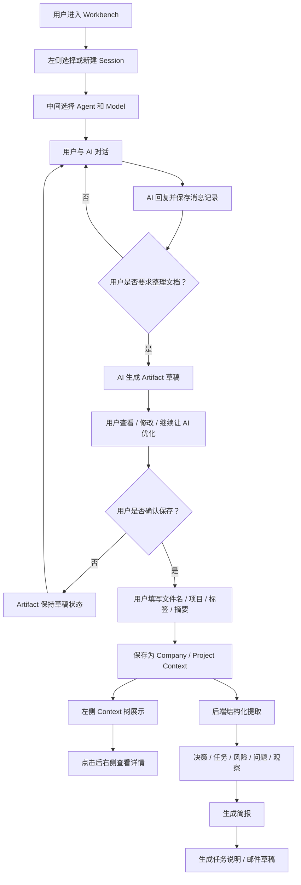

# 产品主流程图

```mermaid
flowchart TD
  A["用户进入 Workbench"] --> B["左侧选择或新建 Session"]
  B --> C["中间选择 Agent 和 Model"]
  C --> D["用户与 AI 对话"]
  D --> E["AI 回复并保存消息记录"]

  E --> F{"用户是否要求整理文档？"}
  F -- "否" --> D
  F -- "是" --> G["AI 生成 Artifact 草稿"]

  G --> H["用户查看 / 修改 / 继续让 AI 优化"]
  H --> I{"用户是否确认保存？"}

  I -- "否" --> J["Artifact 保持草稿状态"]
  J --> D

  I -- "是" --> K["用户填写文件名 / 项目 / 标签 / 摘要"]
  K --> L["保存为 Company / Project Context"]
  L --> M["左侧 Context 树展示"]
  M --> N["点击后右侧查看详情"]
  L --> O["后端结构化提取"]

  O --> P["决策 / 任务 / 风险 / 问题 / 观察"]
  P --> Q["生成简报"]
  Q --> R["生成任务说明 / 邮件草稿"]
```
