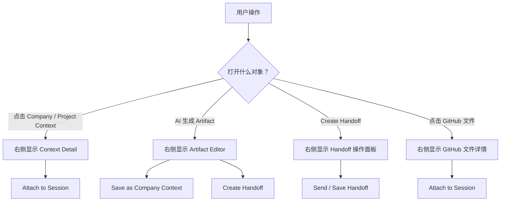

# 右侧动态面板模式图

```mermaid
flowchart TD
  Action["用户操作"] --> Type{"打开什么对象？"}

  Type -- "点击 Company / Project Context" --> Context["右侧显示 Context Detail"]
  Type -- "AI 生成 Artifact" --> Artifact["右侧显示 Artifact Editor"]
  Type -- "Create Handoff" --> Handoff["右侧显示 Handoff 操作面板"]
  Type -- "点击 GitHub 文件" --> Github["右侧显示 GitHub 文件详情"]

  Context --> Attach["Attach to Session"]
  Artifact --> Save["Save as Company Context"]
  Artifact --> CreateHandoff["Create Handoff"]
  Handoff --> Send["Send / Save Handoff"]
  Github --> AttachGithub["Attach to Session"]
```
