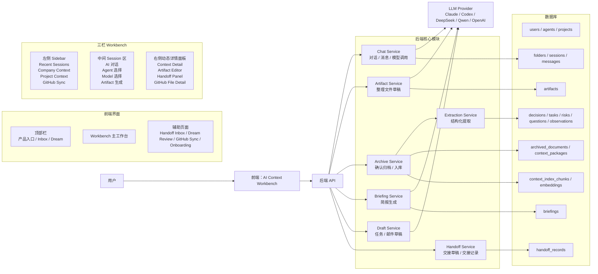
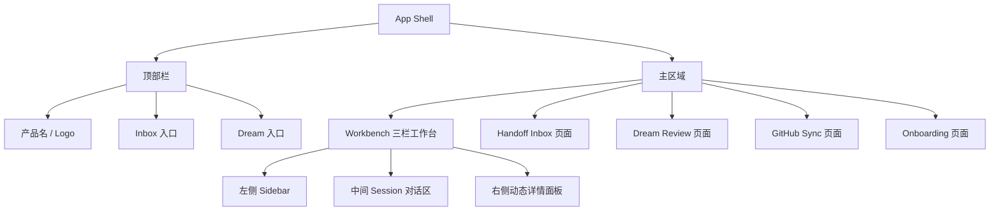
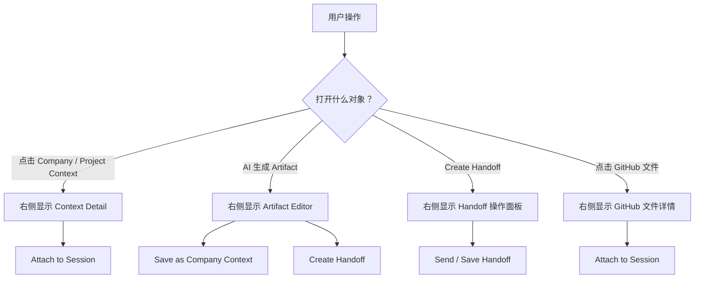
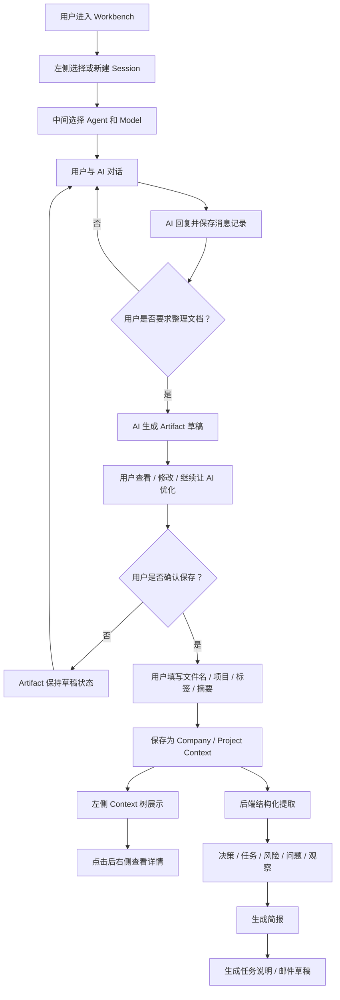
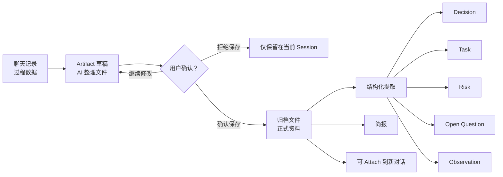
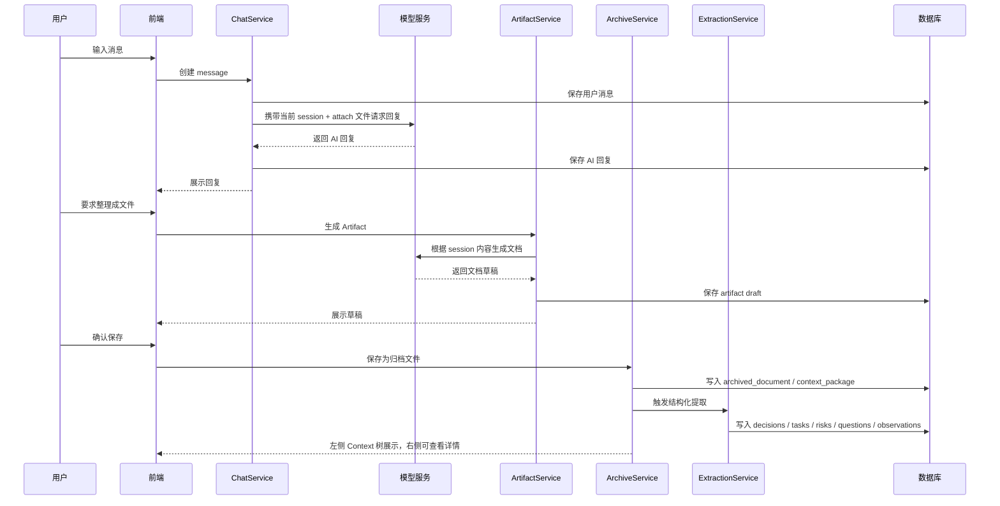

# 项目当前逻辑与架构总览

## 1. 当前结论

项目逻辑已经完成重新梳理，新的产品主线是：

```text
用户进入 AI Context Workbench
-> 在左侧选择或创建 Session
-> 在中间选择 Agent 和 Model 进行对话
-> AI 在对话中生成 Artifact 草稿
-> 用户确认保存后进入 Company / Project Context
-> 后端对确认归档的内容做结构化提取
-> 生成 Decisions / Tasks / Risks / Questions / Observations
-> 后续用于 Briefing、Handoff、任务说明和邮件草稿
```

核心边界：

```text
聊天记录是过程数据，不自动进入资料库。
Artifact 是 AI 生成的草稿，不等于正式资料。
用户确认保存后的 Context 才是正式归档资料。
任务和邮件当前只生成内容草稿，不直接发送。
```

## 2. 前端原型基准

前端样式和交互基准使用当前 HTML 原型：

- 仓库内固定版本：[ai_context_collab_prototype_attach_label_fixed.html](/Users/dudu/Projects/Internship_Program/inter-agent/docs/prototypes/ai_context_collab_prototype_attach_label_fixed.html)
- 原始文件路径：`/Users/dudu/Desktop/ai_context_collab_prototype_attach_label_fixed.html`

后续前端实现应尽量贴近该 HTML 文件的布局、风格和交互节奏。

## 3. 整体架构图

单独文件：[overall-architecture.md](/Users/dudu/Projects/Internship_Program/inter-agent/docs/diagrams/overall-architecture.md)



## 4. 前端页面结构图

单独文件：[frontend-page-structure.md](/Users/dudu/Projects/Internship_Program/inter-agent/docs/diagrams/frontend-page-structure.md)



## 5. 前端三栏 Workbench 图

单独文件：[frontend-workbench.md](/Users/dudu/Projects/Internship_Program/inter-agent/docs/diagrams/frontend-workbench.md)

```mermaid
flowchart LR
  subgraph Left["左侧 Sidebar"]
    L1["New Session"]
    L2["Recent Sessions"]
    L3["Company Context"]
    L4["Project Context"]
    L5["GitHub Sync"]
    L6["账号 / 成员入口"]
  end

  subgraph Center["中间 AI Session"]
    C1["Session 标题"]
    C2["消息流"]
    C3["AI 回复下方操作"]
    C4["Context 引用链接"]
    C5["Composer Context Bar"]
    C6["输入框"]
    C7["Agent 选择"]
    C8["Model 选择"]
    C9["发送按钮"]
  end

  subgraph Right["右侧动态面板"]
    R1["Context 详情"]
    R2["Artifact Editor"]
    R3["Handoff 操作面板"]
    R4["GitHub 文件详情"]
  end

  Left --> Center
  Center --> Right
  Left --> Right
```



## 6. 右侧动态面板模式图

单独文件：[right-panel-modes.md](/Users/dudu/Projects/Internship_Program/inter-agent/docs/diagrams/right-panel-modes.md)



## 7. 产品主流程图

单独文件：[product-main-flow.md](/Users/dudu/Projects/Internship_Program/inter-agent/docs/diagrams/product-main-flow.md)



## 8. 内容状态流转图

单独文件：[content-state-flow.md](/Users/dudu/Projects/Internship_Program/inter-agent/docs/diagrams/content-state-flow.md)



## 9. 后端最小闭环图

单独文件：[backend-minimal-loop.md](/Users/dudu/Projects/Internship_Program/inter-agent/docs/diagrams/backend-minimal-loop.md)



## 10. 前端页面职责图

单独文件：[frontend-page-responsibilities.md](/Users/dudu/Projects/Internship_Program/inter-agent/docs/diagrams/frontend-page-responsibilities.md)

```mermaid
flowchart LR
  subgraph Top["顶部栏"]
    T1["产品入口"]
    T2["Inbox"]
    T3["Dream"]
  end

  subgraph Left["左侧 Sidebar"]
    L1["New Session"]
    L2["Recent Sessions"]
    L3["Company Context"]
    L4["Project Context"]
    L5["GitHub Sync"]
  end

  subgraph Center["中间 Session 区"]
    C1["当前 Session 消息流"]
    C2["Agent 选择"]
    C3["Model 选择"]
    C4["Artifact 草稿生成 / 展示"]
    C5["输入框"]
  end

  subgraph Right["右侧动态详情区"]
    R1["Context 详情"]
    R2["Artifact Editor"]
    R3["Handoff 面板"]
    R4["GitHub 文件详情"]
    R5["Attach 到当前 Session"]
  end

  Top --> Left
  Left --> Center
  Center --> Right
  Left --> Right
```



## 11. 当前代码状态

当前代码已经实现旧 P0 后端链路：

```text
Session transcript
-> Dream
-> ContextPackage
-> Extraction
-> Decisions / Tasks / Risks / Questions / Observations
-> Briefing / Handoff / Query
```

新版链路还需要补齐：

```text
folders
messages
artifacts
archived_documents
session_attachments
ChatService
ArtifactService
ArchiveService
DraftService
```

## 12. 后续开发原则

后续开发应遵循以下顺序，避免返工：

```text
1. 先接入前端原型的核心 Workbench 结构。
2. 先打通 Session / Message / Model 对话。
3. 再实现 Artifact 草稿生成和编辑。
4. 再实现用户确认保存为 Company / Project Context。
5. 再复用现有 ExtractionService 做结构化提取。
6. 再接 Briefing、Handoff、任务草稿和邮件草稿。
7. Dream Review、GitHub Sync、Onboarding 作为后续增强逐步接真实数据。
```
